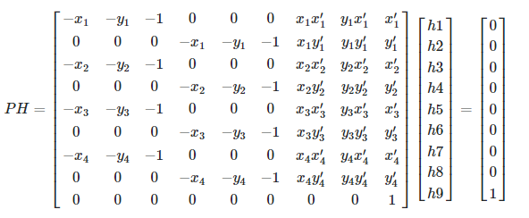
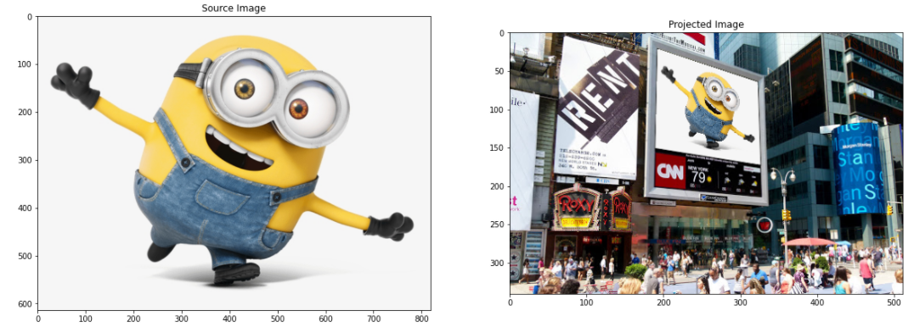
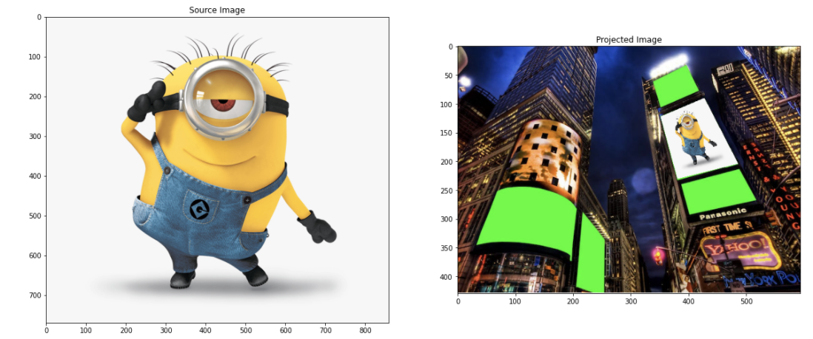
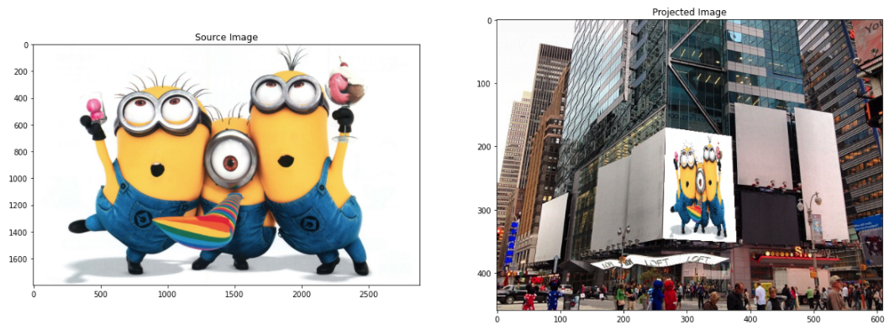
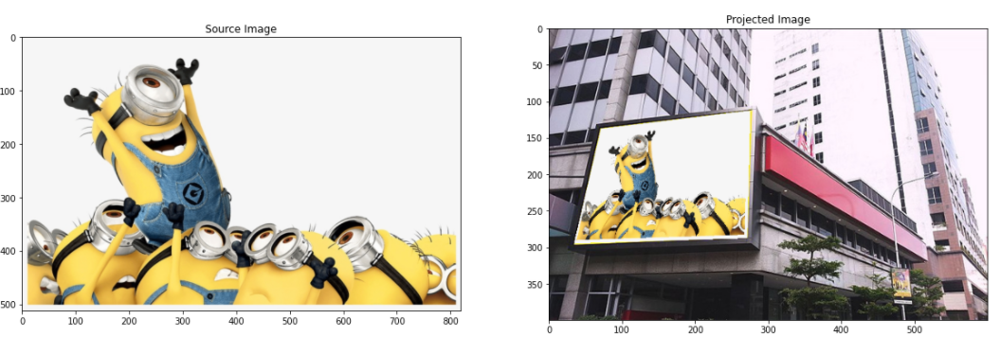
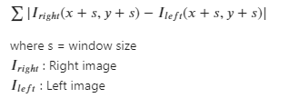
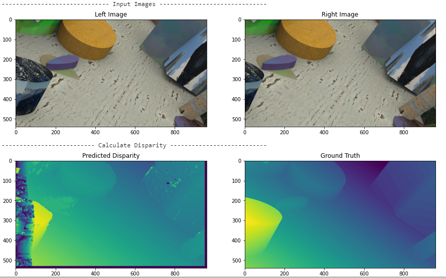
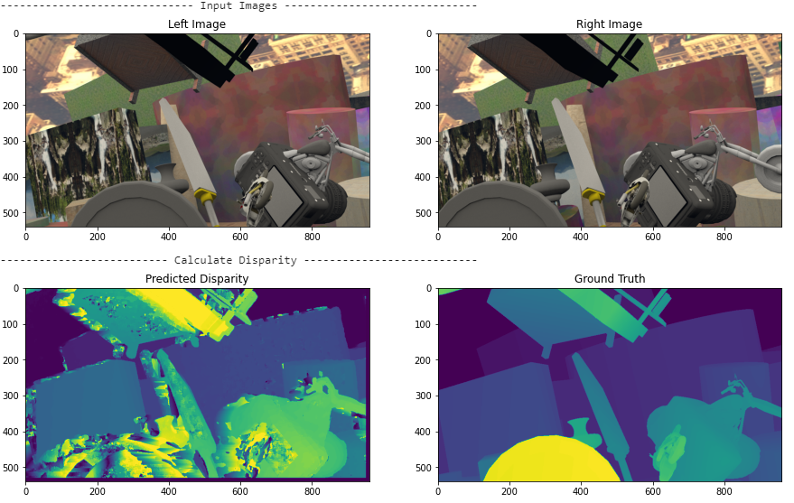
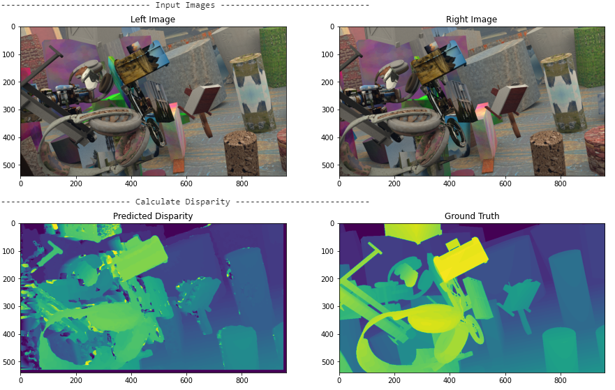
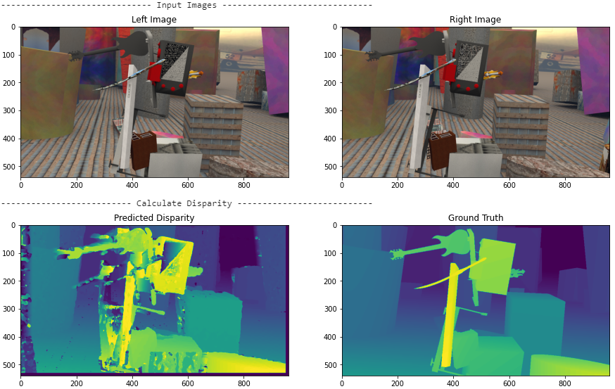

# ComputerVision_Assignment2

## Part 1 -  Putting Happy Minions Faces on Empty Billboards of Times Square

### How to run the code:

1. Input the path of the billboard image in the billboard_image_path variable. 
2. Secondly, input the path of the minion image in the minion_image_path variable.
3. Create an instance of the main class i.e homography_coordinates where you pass in these 2 image path variables. 
4. We can then run the function load_image_get_source_coordinates from the class to display the original images and get the height and width of the minion image which will be useful for performing homography  later. 
5. Then we run the function get_target_coordinates from our class. This will allow the user to select the edges of the billboard where we want to place our minion. The selection should be done in the following order: 

a) Top Left Corner  
b) Top Right Corner  
c) Bottom Left Corner  
d) Bottom Right Corner  

Then press esc or q on the keyboard to close the billboard image window. 

6. Once the coordinates are selected, we can run the perform_homography() function to perform the homography and place the minion on billboard. 

### To apply a perspective transformation :
1. First we have to know four points in a plane A. We do that by getting the coordinates of the 4 edges of the minion image using the function load_image_get_source_coordinates()
2. Then we map these 4 points from source image to the 4 points in plane B which is our target image. We get these coordinates from our target image using the get_target_coordinates() function
3. For each corresponding pair (x1, x1’) in plane A & B we create a 2x9 matrix consisting of the coordinate pairs. Since there are 4 such pairs we’ll get 4 2x9 matrices. We stack them up to create our matrix A which Is an 8x9 matrix and it is given in the code. Since the last component in the vector is considered as 1, we can add one more constraint equation I.e (h9=1). This makes the 'A' matrix a  9x9 matrix. 
4. We set up the linear equations and solve for H.   

  

Ref: Calculation referenced from https://math.stackexchange.com/a/2619023  
  
6. Our H matrix is given in the code by the variable ‘res’ in the function perform_homography(). 
7. Then we apply this H matrix to our minion coordinates and perform the homography. 
8. Then we perform scaling to our transformed coordinates using the scaling factor

### Output images  
* Image 1  

  
* Image 2  

  
* Image 3  

  
* Image 4  
* 


## Part 2 - Stereo Matching

Stereo matching helps us understand the distance of objects in a 2D image with reference to the viewer. In this assignment we are implementing calculation of the disparity matrix to predict this distance. We have been provided with the ground truth disparity matrix. The aim is to calculate a disparity matrix which is as close the ground truth as possible. 
In our calcilation approach, we chose a patch size of 10 pixels by 10 pixels and interated over the image with search range as 100 pixels. 

We compared a block of pixels from the left image with a block of pixels in the right image using the sum of abs difference method. For the (i,j)-th pixel in the left image, we can scan and find the most similar pixel in the right image at i-th row using Manhatten distance. For example, the search was done from right_image(i,j+99,:) to right_image(i,j-99,:) to see which pixel among the 100 are the closest.The index-distance of the closest pixel is then recorded. We are using a window size of 10 pixels. And the distance is calculated by scanning the window size over search range of 100 pixels. This distance is stored  to create a matrix called “disparity matrix”, whose (i, j)-th element says the index-distance between the (i, j)-th pixel of the left image and its closest pixel in the right image. 

We used following logic to calculate the distance:  


To run the code please use following steps:
```{python}
StereoMatch_img = StereoMatch(location, left_image, right_image, gt_image)

StereoMatch_img.show_input_images()

disparity_mat = StereoMatch_img.calc_disparity_mat()
StereoMatch_img.show_compare_results(disparity_mat)
    
StereoMatch_img.calc_evaluation_metric(disparity_mat)
```
The results are as below:

### Evaluation metrics

|Image|End Point Error|Error Rate|
|-----|---------------|----------|
|Image 1 |  6.3775  | 13.88194 |
|Image 2 | 15.61004 | 35.64738 |
|Image 3 |  7.48113 | 26.77469 |
|Image 4 | 10.01937 | 28.97801 |

### Output images  
* Image 1  

  
* Image 2  

  
* Image 3  

  
* Image 4  
* 
